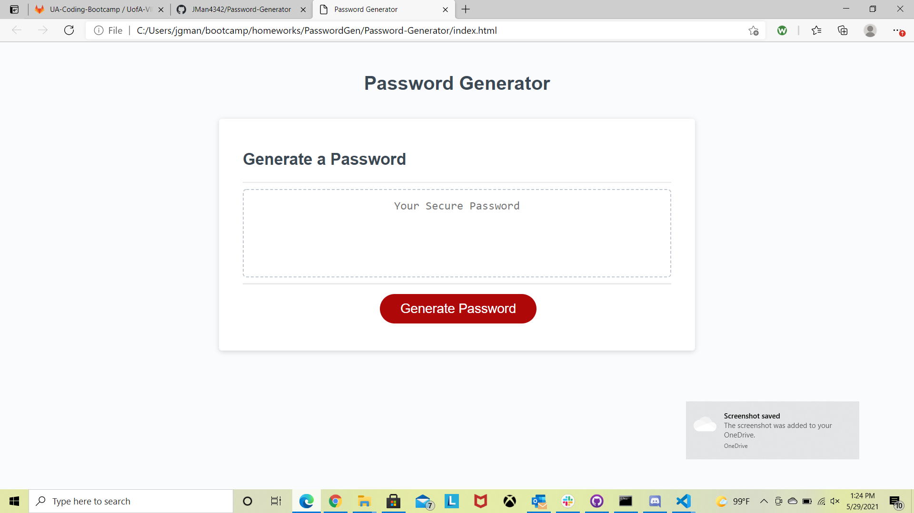
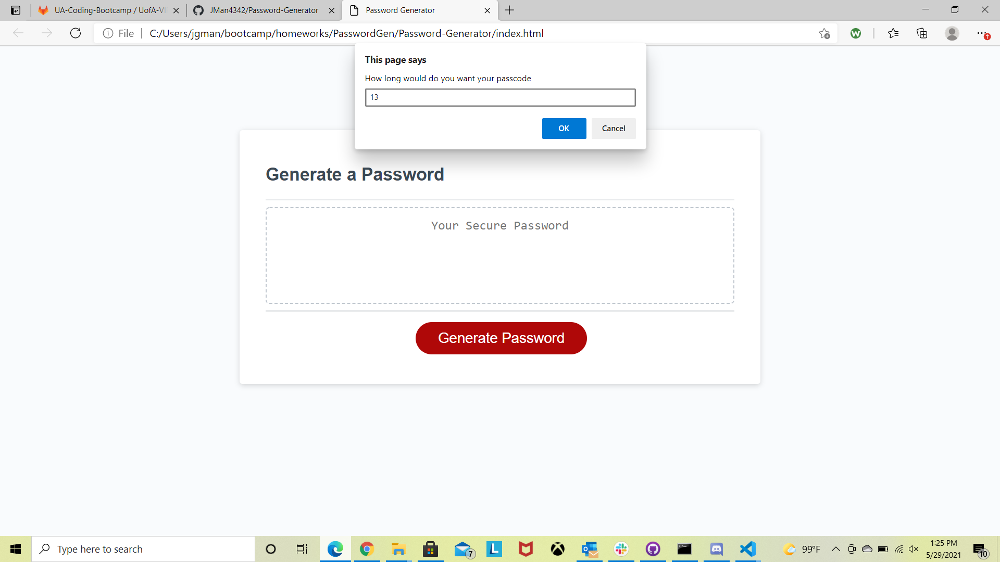
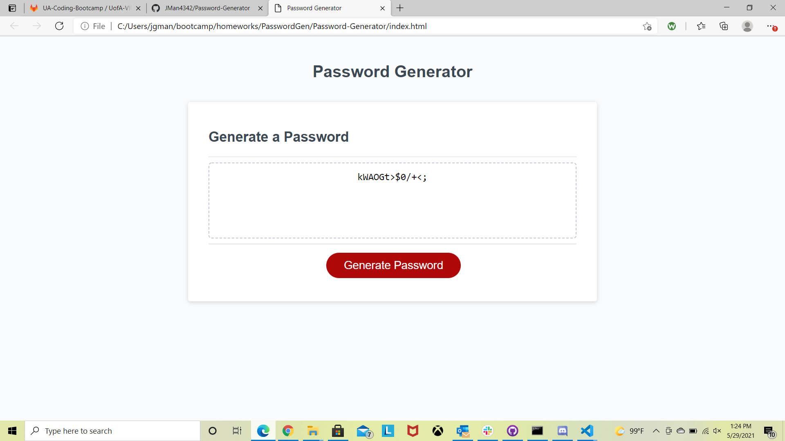

# Password-Generator
---

## Description

This assignment you will find a random password generator that is powered with JavaScript.  Some of the skills demonstrated during this assisgnemt include but not limited to:
* Looping functions.
* Utilizing if functions.
* Creating prompts to capture user feedback.

---

## Image

Below are images of my completed password generator page.

---

## Resources

I utilized the following sites to assist in creating my portfolio webpage.
* https://www.w3schools.com/
* https://www.javatpoint.com/
* https://developer.mozilla.org/
* https://stackoverflow.com/

---

## Application

You can find my portfolio page at the following:

* https://jman4342.github.io/Password-Generator/
